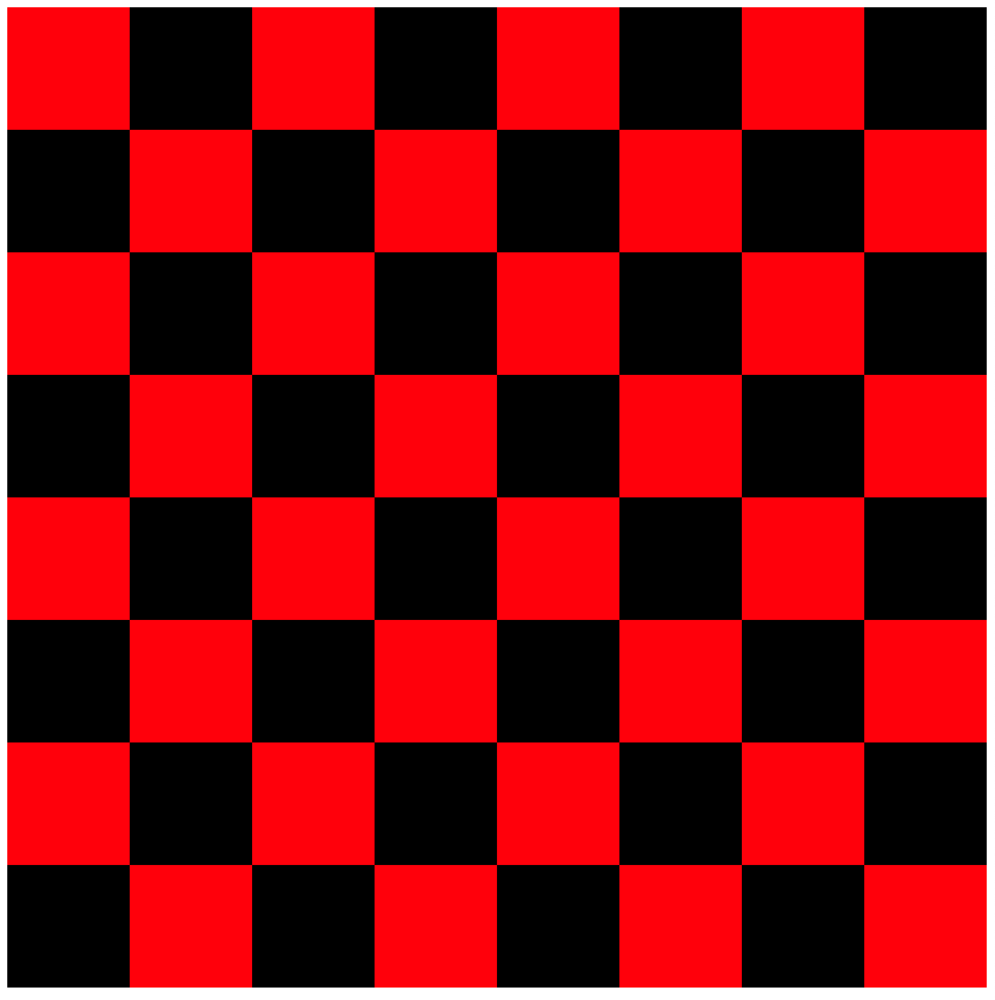
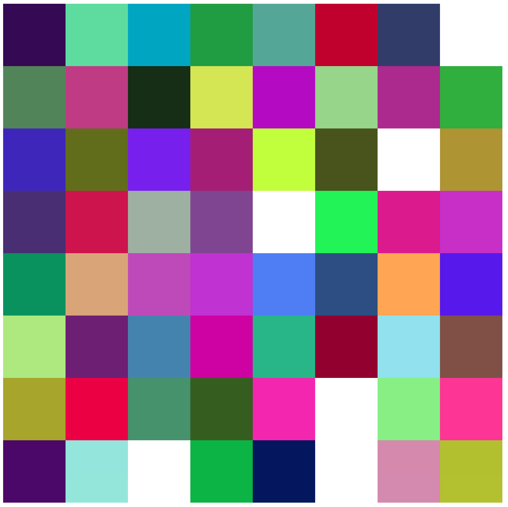
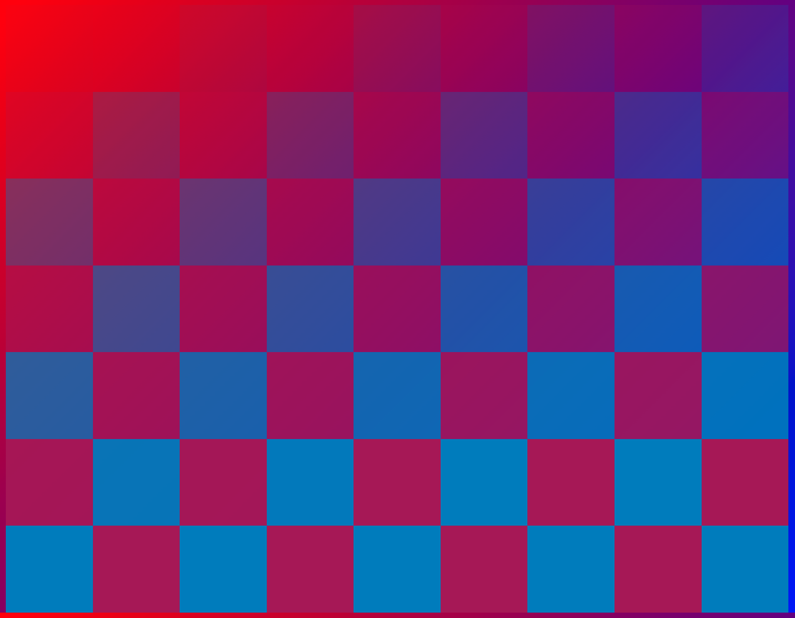

# DOM Manipulation Exercise

As always, fork and clone this repo.  Submit the link to your fork when you're done.

### Checkerboard

On the master branch, write code to generate a checkerboard pattern as seen below:

**The Rules**

You are not allowed to edit the html file, which means that you must create all the tiles dynamically.  Same goes for CSS: no CSS in the html file or in a separate stylesheet. You must set all the style properties using Javascript.

**Hints**

* Create a container for your tiles with the following styles:
    * `display = "flex"`;
    * `flexWrap = "wrap"`;
    * `width = "800px"`;
    * `height = "800px"`;
* Each tile should have the following styles:
    * `width = "12.5%'`
    * `height = "12.5%'`

**JUST TO REITERATE, YOU WILL NOT WRITE ANY HTML OR CSS FOR THIS EXERCISE.  ONLY JS!!!**

### Random Colors

On a new branch called `randomcolors`, implement the following changes:

1. Instead of being either red or black, each tile should be a random color.  How do you generate random colors?  You can use RGB or Hexadecimal as your color system.

### Gradient

On a new branch called `gradient`, write code to color the tiles using some sort of gradient.  It does not need to look exactly like the image below, but it should have some sort of increasing/decreasing color values.

### Flashing Colors

On a new branch called `flashing`, write code to change each tile's color to a new random color every 2 seconds. 

### Bonus: Audio

Get some audio playing to accompany your trippy visuals, using only JS.  No editing the HTML!
